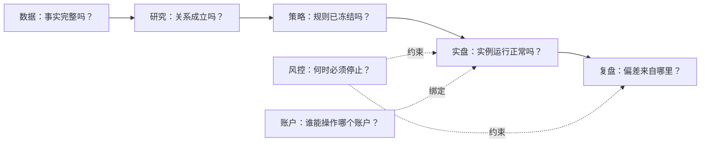

# Orbit 七页合理化设计（PAGE-1）

状态：`ACCEPTED`（2026-08-11 Claude 评审冻结;§14 六项决策全部确认——①数据页首屏以正式版本为主;②研究页以量价关系为主题、旧候选下沉档案;③实盘页 Paper/Live 实例分列、执行详情二级;④复盘三层对比、3x 理论缺读模型时明确留空不得前端拼算;⑤账户页首屏改连接健康+绑定、用户管理下沉;⑥批 A→B→C 独立验收、不夹带读模型开发。授权按批实施展示层;读模型缺口按 §11 归属另立任务）  
日期：2026-08-11  
适用路由：`#data`、`#research`、`#strategy`、`#forward`、`#review`、`#risk`、`#accounts`

## 1. 文档目的与约束

本文把 `SYSTEM_MODULE_REDESIGN.md` 已确认的七项一级导航展开为可实施的页面规范。它定义信息顺序、字段含义、状态语言、交互边界、空状态、响应式行为、当前数据来源和后续读模型缺口；不授权修改后端、TB4、DATA-1R 或实盘协议。

设计遵守以下硬约束：

1. 用户进入任一页面后，首屏应在 10 秒内回答该模块的核心问题。
2. 每个数字必须同时具备名称、单位、统计口径和事实来源；不同单位不得相加。
3. 任务状态、数据完整性、研究结论、策略准入、运行状态和执行结果分别表达。
4. 只读页面没有副作用控件；写动作集中在明确的操作区，带权限、确认和审计反馈。
5. 空页面必须说明“为什么为空、下一步做什么、不会造成什么影响”。
6. 首轮优先复用现有读模型。需要新后端数据的内容标为 `READ-MODEL GAP`，不得用前端推算或假数据填充。
7. 本设计不切换 TB4 数据源，不重建 Paper/Live 账本，不扩大实盘资金、杠杆或账户范围。

## 2. 七页共同框架

### 2.1 用户任务流

箭头表示用户理解顺序，不表示模块可以直接读取对方存储。页面只消费应用层提供的只读投影或明确的命令接口。

### 2.2 页面壳层

所有一级页使用相同的顶部结构：

1. 面包标签：模块名称。
2. 问题式主标题：直接对应模块核心问题。
3. 一句范围说明：说明本页负责什么、不负责什么。
4. 全局入口：术语帮助、全局风控状态。
5. 模块语义标签：例如数据页“历史研究数据 · 与实盘隔离”，研究页“预注册 · 结果只追加”。

桌面端内容最大宽度沿用现有应用壳；卡片以 4 列、2 列和通栏三种栅格组合。窄屏小于 720px 时：

- 一级导航横向滚动且不换成隐藏菜单；当前项始终可见。
- 指标卡改为单列；表格保留横向滚动，不压缩到无法辨认。
- 主动作放在区块标题下方，占满可用宽度。
- 风险警报和完整性错误保持首屏可见，不折叠。

### 2.3 状态语言

| 状态维度 | 允许值示例 | 页面主标签 | 禁止混用 |
|---|---|---|---|
| 后台任务 `JobStatus` | QUEUED/RUNNING/SUCCEEDED/FAILED/CANCELLED | 等待执行/正在运行/任务完成/任务失败/已停止 | 不写“研究通过”或“数据完整” |
| 数据版本 `DatasetState` | DRAFT/BUILDING/COMPLETE/INVALID | 草稿/构建中/完整/不完整 | 不写“评估成功”；新鲜度另列 |
| 研究结论 `ResearchVerdict` | SUPPORTED/NOT_SUPPORTED/INCONCLUSIVE/INVALID | 得到支持/未得到支持/证据不足/实验无效 | 不写“任务失败” |
| 策略准入 `AdmissionDecision` | DRAFT/RESEARCH_SUPPORTED/BACKTEST_CONFIRMED/PAPER_APPROVED/LIVE_PILOT_APPROVED/RETIRED | 草稿/研究证据支持/回测已确认/批准模拟盘/批准受限实盘/已退役 | 不含协议停机，不等同运行状态 |
| 运行实例 `RuntimeStatus` | NOT_STARTED/WARMING/RUNNING/DEGRADED/STOPPED | 未建立/预热中/运行中/降级/已停止 | 不等同策略准入 |
| 执行结果 `ExecutionStatus` | PENDING/COMPLETED/COMPLETED_WITH_ERRORS/BLOCKED | 待执行/执行完成/完成但有异常/已拦截 | 不等同研究结论 |

颜色只作辅助：绿色表示该维度当前正常或完成，蓝色表示信息/进行中，橙色表示等待/降级，红色表示失败、拦截或已触发停止。任何状态必须有文字，不能只靠颜色。

### 2.4 数字与来源

每个数字的辅助文本至少包含以下两项中的一项：时间截止点、来源名称。悬停或详情中补齐完整来源。

| 类型 | 显示格式 | 口径要求 |
|---|---|---|
| 金额 | `1,234.56 USDT` | 指明权益、名义金额、手续费或已实现盈亏 |
| 比例 | `12.34%` | 指明分母；权重与收益率不可只写裸数 |
| 时间 | 本地时间 + 时区；详情保留 UTC/毫秒 | 指明是数据截止、信号收盘、下单或同步时间 |
| K线 | `1,024 根 15m K线` | 周期是单位的一部分 |
| Funding | `2,160 条结算记录` | 不与 K线或文件数相加 |
| 归档 | `101,732 个归档分区` | 明确不是 K线根数 |
| 订单 | `12 笔尝试 / 10 笔完成` | 区分订单、成交和市场数量 |
| 偏差 | `%` 或 `bps` | 收益偏差用百分比，成交价偏差用 bps |

### 2.5 页面级刷新、错误和权限

- 自动刷新的页面显示“最后更新”和刷新周期；手动刷新只读，不写业务事实。
- 单一区块失败时只在该区块报错；不得让数据任务错误覆盖研究结果，或让账户同步错误遮蔽策略定义。
- `401` 显示登录页；`403` 显示“当前账户无权查看/操作”，不能伪装成空数据。
- 写操作完成后显示业务结果、审计编号或任务 ID。仅显示“保存成功”不足以验收。

## 3. 数据页 `#data`

### 3.1 核心问题与首屏

核心问题：**当前历史研究数据是什么版本，覆盖到哪里，质量是否足以开展研究？**

首屏从上到下：

1. 当前正式数据版本卡。
2. 四项摘要：截止时间、合约覆盖、质量异常、任务状态。
3. 若有活动任务，显示任务进度与单飞锁；否则显示“建立/更新数据集”入口。

当前版本卡字段：

| 字段 | 展示 | 来源 |
|---|---|---|
| 版本 ID | `shortline-data-v1` | 当前 `/api/research/datasets` 中正式 manifest；MOD-2 后迁 `/api/data/versions/current` |
| 数据状态 | 完整/构建中/不完整/已过期 | manifest `dataset_state`，不得从文件数量推断 |
| 内容指纹 | 前 12 位 + 可复制完整 SHA-256 | manifest `sha256` |
| 数据截止 | 最新完整 15m 收盘时间 | `READ-MODEL GAP D-01` |
| 基础/派生周期 | 15m；1h/4h | 版本 schema/质量报告 |
| 质量摘要 | 缺失、重复、停牌窗口、原生聚合差异分别计数 | `READ-MODEL GAP D-02` |
| 构建时间 | 本地时间 | manifest generated/updated time |

完整状态只能由版本事实源给出。活动任务已完成多少分区不能代替数据版本完整性。

### 3.2 主要区块

#### A. 版本历史

按创建时间倒序显示版本 ID、状态、截止时间、合约数、归档分区数、质量报告 hash、内容指纹。点击版本只打开只读抽屉，不切换任何研究或实盘数据源。

空状态：尚未生成正式版本；提示“先完成 DATA-1R 构建与质量校验”，同时明确“实盘行情不依赖这里，不会因此停止”。

数据来源：`READ-MODEL GAP D-03`。首批实施可只显示当前版本，并将历史区标为“版本历史将在数据目录服务接入后展示”。

#### B. 合约覆盖

摘要分开显示：

- 已覆盖合约：个；
- 当前活跃合约：个；
- 已退市合约：个；
- 归档分区：个；
- K线：按周期分别显示根数；
- Funding：结算记录数。

列表支持按 symbol、活跃/退市、起止时间和异常状态筛选。不得显示一个混合“总记录数”。

数据来源：`READ-MODEL GAP D-04`；不得在浏览器遍历 10 万条 manifest 临时聚合。

#### C. 数据质量与停牌窗口

四类质量事实分别成卡：checksum、时间连续性、重复时间戳、15m→1h/4h 原生聚合一致性。停牌窗口单列市场、开始、结束、缺失根数、证据来源和登记状态，不把真实停牌标为文件损坏。

异常按严重度排序：阻断 COMPLETE > 需要复核 > 已登记停牌。每条异常提供版本/分区深链，不提供“忽略并继续”的快捷按钮。

数据来源：DATA-1R quality report；需要 `READ-MODEL GAP D-02` 提供摘要和分页明细。

#### D. 数据任务控制

活动任务卡显示：任务 ID、任务状态、阶段、完成/总分区、已校验/总字节、当前 symbol/文件、错误数、最近日志、启动人、开始时间、锁 owner/PID。任务状态和正式数据版本状态上下分区。

写动作：

- “开始建立/增量更新”：仅管理员；必须勾选 8–12 GB 磁盘确认；后端再次校验磁盘与单飞锁。
- “停止任务”：仅活动任务；二次确认说明已通过 checksum 的文件会保留，可续传。
- “拉取单市场数据”：放在次级工具区，不与正式全市场版本混为一体。

成功返回任务 ID；冲突显示当前锁持有者；禁止页面自行解锁。

#### E. 实时行情健康

只显示公共行情通道是否新鲜、最后完整 K线时间、延迟和缺口；不显示账户余额、持仓或 API 凭证。当前没有独立数据健康读模型，登记为 `READ-MODEL GAP D-05`，首批不得用实盘账户同步状态代替。

### 3.3 禁止项

- 不显示研究 SUPPORTED/NOT_SUPPORTED。
- 不显示策略准入、当前仓位或账户权益。
- 不提供 TB4 数据源切换。
- 不把任务完成写成“数据完整”，也不把停牌窗口写成下载失败。

## 4. 研究页 `#research`

### 4.1 核心问题与首屏

核心问题：**量价关系是否存在、是否可重复，当前正在验证哪条假设？**

首屏：

1. 主题卡“量价关系”，展示目标、绑定数据版本和当前阶段。
2. 进行中实验卡；没有实验时明确下一步是预注册，不自动启动。
3. 四项摘要：预注册假设数、运行中实验数、得到支持数、证据不足/未支持数。

主题卡不出现策略收益承诺、Paper/Live 授权或数据下载按钮。

### 4.2 主要区块

#### A. 假设列表

每行把三个维度分列：

| 列 | 内容 |
|---|---|
| 假设身份 | ID、名称、版本、研究族 |
| 预注册 | 冻结状态、冻结时间、协议 hash、数据版本 hash |
| 实验任务 | 最近一次 QUEUED/RUNNING/SUCCEEDED/FAILED/CANCELLED |
| 研究结论 | PENDING/SUPPORTED/NOT_SUPPORTED/INCONCLUSIVE/INVALID |
| 证据 | 样本区间、市场数、报告 hash、引擎版本 |

`SUCCEEDED + NOT_SUPPORTED` 必须可以同时出现，且视觉上不矛盾。

#### B. 预注册向导

采用四步纵向向导：

1. 写清假设、方向和预测窗口；
2. 冻结变量、过滤条件、成本和市场范围；
3. 绑定不可变数据版本与点时截止；
4. 写死及格线、失效条件和多重检验处理。

最终按钮为“冻结预注册”，不是“创建策略”。确认框说明冻结后不可修改，只能新建版本。成功显示 candidate/experiment ID 与 hash。

现有 M0/F1/G1/G2 模板可继续复用；R-0 需要的结构化变量与数据版本绑定登记为 `READ-MODEL GAP R-01 / COMMAND GAP R-02`，由 MOD-3 实现，不在页面批次中伪造。

#### C. 实验运行与历史

只显示没有 `job_type` 的实验任务；DATA-1R 和单市场拉取永远不进入此列表。运行行显示任务状态、进度、候选 ID、开始/结束时间和错误摘要。程序错误放任务详情，统计结论放结果详情。

#### D. 结论、证据与墓地

当前候选详情依次显示：预注册内容、成本、测试矩阵、门槛、逐项证据、最终 verdict。支持的假设进入“得到支持”，其余进入“未支持/证据不足/实验无效”；这些记录永久保留，统一称“研究墓地”时必须避免贬义替代正式 verdict。

报告数字必须绑定报告 hash、数据 hash、代码/引擎版本和截止时间。缺少任何绑定时显示“证据链不完整”，不展示成可准入结论。

#### E. 既有研究档案

M0/F1/G1/G2 放在页面底部折叠区，保留现有冻结定义和结果，不占据量价关系主流程。标签明确为“历史研究档案”，不把旧 funding 研究误称为量价关系。

### 4.3 空状态与禁止项

- 无预注册：说明先冻结假设，不能直接跑数。
- 无结果：区分“尚未运行”“任务失败”“运行成功但报告不可用”。
- 数据版本不可用：禁止启动实验，并深链数据页；不在研究页修复或下载数据。
- 不提供策略准入、实盘启用、下单或账户选择。

## 5. 策略页 `#strategy`

### 5.1 核心问题与首屏

核心问题：**哪些交易规则已经冻结并获准进入哪个阶段？**

首屏由正式策略目录和所选策略身份卡组成。TB4 卡必须展示名称、策略 ID、版本、定义 hash、证据等级、最新准入决定、部署 commit、最近/下次再平衡。准入决定与运行实例状态分开；现有 `RESEARCH_ONLY/PAPER_FORWARD/LIVE_PILOT/PROTOCOL_STOPPED` 等兼容生命周期投影只能作为迁移期辅助字段，不能冒充新的 `AdmissionDecision`。

### 5.2 主要区块

1. **策略目录**：未来可多策略选择；目录只列完整 `StrategyDefinition + EvidenceBundle`。
2. **策略如何工作**：普通语言摘要与冻结规则表双层展示，参数完全来自后端定义。
3. **准入状态时间线**：DRAFT、RESEARCH_SUPPORTED、BACKTEST_CONFIRMED、PAPER_APPROVED、LIVE_PILOT_APPROVED、RETIRED；每一节点显示决策时间、证据引用和批准记录。协议停机属于 Runtime/Risk 事实，另行显示，不写入准入时间线。
4. **证据包**：历史总览、walk-forward、参数稳健性、成本/市场贡献；未接入图表时诚实显示缺口。
5. **已知风险**：固定展示幸存者偏差、市场状态、成本、震荡亏损、样本量、交易所变化等。
6. **只读跳转**：查看研究来源、进入实盘、查看风控、查看账户绑定。

当前 `/api/strategies` 可支撑身份、冻结参数和风险；证据曲线与准入时间线分别登记 `READ-MODEL GAP S-01/S-02`。页面不得从研究 registry 或运行状态反推准入。

### 5.3 禁止项

- 无调参、启停、下单、恢复、账户凭证操作。
- 不把 3x 投影称为新策略。
- 不在前端重算 TB4 信号、权重、绩效或生命周期。
- 定义/证据 hash 不一致时 fail closed，不展示可能失配的绩效数字。

## 6. 实盘页 `#forward`

### 6.1 核心问题与首屏

核心问题：**每个策略实例现在是否健康，最新冻结目标是否已正确执行和核对？**

首屏健康条按实例分列，而不是把 Paper 与 Live 混成单一状态：

| 实例 | 必显字段 |
|---|---|
| TB4 Paper | 实例 ID、运行状态、账本健康、最近有效再平衡、下一次预计再平衡 |
| LIVE-SMALL Live | 实例 ID、策略版本、账户绑定、执行闸门、最近执行结果、最近持仓核对 |

全局异常按优先级显示：协议停机/账本无效 > 持仓偏差 > 数据过期 > 等待下一轮。策略准入仍从策略模块读取，不用运行状态替代。

### 6.2 页面分层

一级视图只保留运营摘要：

1. 实例健康与绑定关系；
2. 当前信号使用的收盘时间；
3. TB4 原始目标、3x 执行目标和可执行覆盖；
4. 本轮冻结清单摘要；
5. 最新执行报告摘要；
6. 最新持仓核对摘要。

二级“执行详情”承接：计划、订单意图、交易所回执、成交、手续费、滑点和逐市场对账。首期可用页内锚点/抽屉实现，稳定路径建议 `#forward/executions/{execution_epoch}`。返回必须保持筛选和所选轮次。

### 6.3 写操作区

小资金实盘启用向导保留，但与日常观察区明确分隔，仅管理员可见：

1. 选择专用账户；
2. 建立冻结基准；
3. 准备主网账户与生产预检；
4. 输入固定确认短语，启用自动执行。

每步展示副作用、前置条件和审计结果。启用不会被描述为“立即下单”；只有冻结清单 READY 且逐轮闸门通过才可执行。

急停入口在实盘页只作为实例级紧急动作，另在风控页提供完整上下文；两处调用同一命令并写同一审计事实。

当前数据主要来自 `/api/state`、受控 live-pilot 命令和 `/api/live-execution/reports`。实例分列和稳定深链登记为 `READ-MODEL GAP L-01/L-02`；首批重排不得修改 runner 或账本。

### 6.4 空状态与禁止项

- Paper 未初始化：解释需要建立冻结基准，且不会自动创建。
- Live 未绑定：说明先在账户页准备专用账户，再由管理员运行向导。
- 无清单：区分“未到再平衡时间”“规则过期”“前置条件不满足”。
- 无执行报告：说明默认不会发送订单，而不是显示 0% 成功率。
- 不修改策略参数，不解释完整研究历史，不把手工模板下载写成已执行。

## 7. 复盘页 `#review`

### 7.1 核心问题与首屏

核心问题：**理论目标、3x 执行目标和真实结果累计偏离多少，最近一轮为什么？**

首屏固定展示：

- 累计跟踪偏差（百分比，明确不同风险倍数）；
- 最近一轮执行结论；
- 结构性可执行比例；
- 完成轮次数与异常轮次数；
- 数据截止/最后同步时间。

### 7.2 三层对比与归因

权益区同时保留三条语义不同的序列：TB4 原始模拟盘、3x 理论投影、LIVE-SMALL 实际。当前只有原始 Paper 与 Live 时，3x 理论线显示“尚未接入”，不得用 Live 或简单前端乘法代替，登记 `READ-MODEL GAP V-01`。

累计偏差拆为：风险倍数差异、最低名义金额/取整、信号到下单延迟、成交滑点、手续费、Funding、未成交/部分成交、剩余不可归因。不可归因部分不得被自动归入滑点。归因读模型登记为 `READ-MODEL GAP V-02`。

### 7.3 逐轮报告与协议检查点

逐轮列表按再平衡时间倒序；选择后展示清单版本、目标、订单、成交、持仓、费用和异常。页面只读，刷新报告不改变账本。

“三个月加仓评估”显示观测起点、下次检查日、协议条件和当前证据；页面只提示是否到期，不自动批准加仓。人工书面归因和批准记录需要后续审计读模型 `READ-MODEL GAP V-03`。

历史日报作为次级标签保留，并明确是旧网格/平台历史，不与 TB4 执行复盘混算。

### 7.4 空状态与禁止项

- 无权益起点：说明需专用账户、READY 清单和成功同步。
- 无执行轮次：说明尚未产生已结束报告。
- 非管理员：说明执行证据包含账户级信息而无权查看；不是“没有数据”。
- 不修改状态，不提供补单、重试、恢复或加仓批准按钮。

## 8. 风控页 `#risk`

### 8.1 核心问题与首屏

核心问题：**当前离 30% 停机线还有多远，是否已有护栏触发？**

首屏先显示最高级风险横幅，再显示 Paper 与 Live 回撤水位。每个水位包含当前回撤、30% 阈值、剩余距离、权益起点和截止时间。无法计算时显示“无有效起点，自动执行会拒绝新订单”，不能显示为 0%。

### 8.2 主要区块

1. **停止条件**：Paper/Live 回撤、执行协议、账本完整性、未知持仓、未完成轮次、数据新鲜度；程序条件与人工复核条件分开。
2. **护栏状态**：PROTOCOL_STOP、VIOLATION、未完成轮次、防重复、持仓核对等，显示事实来源和最后检查时间。
3. **急停区**：管理员、红色危险样式、必须填写原因并二次确认；成功返回审计 ID 和停止时间。
4. **恢复流程说明**：只读列出诊断、证据、人工批准和恢复步骤。恢复命令不与急停并排；若现有恢复入口保留，应放独立受控流程并再次确认。
5. **审计日志**：急停、恢复、预检、确认等动作，按时间倒序，不可编辑。
6. **旧网格风控**：仅有 legacy 配置时折叠展示，明确不参与 TB4 停机判断。

当前 `/api/state` 与管理员急停/恢复命令可支撑大部分内容；跨实例统一护栏读模型、原因必填契约和审计深链登记 `READ-MODEL GAP K-01/K-02`。

### 8.3 禁止项

- 不修改策略定义或阈值。
- 不提供绕过护栏、清空账本或强制成功。
- 不因 Live 已停而隐藏 Paper 风险，反之亦然。
- 风险正常只代表当前观测未触发，不代表策略安全或未来不亏损。

## 9. 账户页 `#accounts`

### 9.1 核心问题与首屏

核心问题：**有哪些用户和交易账户，连接是否健康，分别绑定到哪个策略实例？**

首屏先展示账户列表和连接健康摘要，而不是先展示用户管理表：账户总数、已连接、同步异常、无凭证、活跃实例绑定数。管理员再进入用户/账户维护；业务用户只看自己有权访问的账户。

### 9.2 主要区块

#### A. 账户与连接健康

每行显示账户名称/ID、所属用户、交易所与市场类型、主网/测试网/只读模式、账户状态、凭证是否存在、最后同步、同步结果、权益（USDT）、绑定实例。错误显示可操作原因，但不得返回 Secret 或完整 API Key。

“同步”是明确写动作：显示将访问 Binance 私有接口，不会下单；完成后显示同步时间和结果。同步失败不把旧权益伪装成最新值。

#### B. 账户与策略实例绑定

只读主视图显示 `账户 → RuntimeInstance → StrategyDefinition`：绑定状态、有效期、主执行实例和冲突检查。创建/变更绑定属于后续控制面流程，首批只展示，不在账户表中临时加下拉框。数据来自 `/api/strategy-control/bindings`，登记前端接入缺口 `READ-MODEL GAP A-01`。

#### C. 用户、账户和凭证维护

管理员可新增/编辑用户和账户；保存凭证使用密码输入，不回显已保存值。保存按钮明确区分“保存账户资料”和“保存 API 凭证”。敏感写操作必须有结果反馈和审计记录。

空状态分别说明：

- 无账户：管理员先创建交易账户；
- 无凭证：保存 Binance API Key/Secret 后才可同步；
- 未绑定实例：不会参与自动执行；
- 无权限：联系管理员授权，不显示其他用户账户。

### 9.3 禁止项

- 不展示策略参数、研究结果、下单按钮或当前信号。
- 不回显、复制或记录明文 Secret。
- 不允许一个账户同时存在冲突的活跃绑定。
- “连接成功”不等于“允许实盘”，后者由实例、准入和执行闸门共同决定。

## 10. 跨页导航与深链

| 起点 | 目标 | 上下文 |
|---|---|---|
| 数据异常 | 数据版本/分区详情 | version ID、symbol、partition |
| 研究实验 | 绑定数据版本 | dataset version hash，只读 |
| 研究结论 | 策略来源 | experiment/result hash |
| 策略目录 | 实盘实例 | strategy ID/version |
| 策略目录 | 风控 | strategy/instance ID |
| 实盘摘要 | 执行详情 | execution epoch |
| 实盘摘要 | 复盘轮次 | rebalance time/epoch |
| 风控审计 | 实盘实例 | instance ID、audit ID |
| 账户绑定 | 策略/实盘 | account ID、instance ID |

深链只携带不可变 ID 或筛选条件，不携带可执行命令。用户无权限时返回明确 403 状态；找不到历史 ID 时显示“记录不存在或当前用户不可见”，不跳回默认首页掩盖问题。

## 11. 读模型缺口登记

PAGE-1 只登记，不实现以下缺口：

| ID | 所属页 | 所需能力 | 建议归属阶段 |
|---|---|---|---|
| D-01 | 数据 | 当前版本统一截止时间 | MOD-2 Data catalog |
| D-02 | 数据 | 质量摘要与分页异常/停牌窗口 | MOD-2 Data quality |
| D-03 | 数据 | 数据版本历史 | MOD-2 Data catalog |
| D-04 | 数据 | 合约与分区覆盖聚合 | MOD-2 Data catalog |
| D-05 | 数据 | 公共实时行情健康 | MOD-2/Runtime adapter |
| R-01 | 研究 | R-0 结构化假设/变量/实验投影 | MOD-3 Research |
| R-02 | 研究 | 数据版本绑定的预注册命令 | MOD-3 Research |
| S-01 | 策略 | 结构化证据图表 bundle | MOD-4 Strategy |
| S-02 | 策略 | 准入状态时间线 | MOD-4 Admission |
| L-01 | 实盘 | Paper/Live 独立实例摘要 | MOD-5 Runtime |
| L-02 | 实盘 | 稳定执行详情深链 | MOD-5 Execution |
| V-01 | 复盘 | TB4 原始/3x 理论/Live 实际三曲线 | MOD-5 Review |
| V-02 | 复盘 | 完整偏差归因 | MOD-5 Review |
| V-03 | 复盘 | 协议检查点人工归因/批准记录 | MOD-5 Audit |
| K-01 | 风控 | 跨实例护栏投影 | MOD-5 Risk |
| K-02 | 风控 | 风险动作审计深链 | MOD-5 Audit |
| A-01 | 账户 | 账户↔实例绑定视图接入 | ARCH-1/账户前端 |

缺口没有接入前，页面必须用明确的“尚未接入”空状态；禁止前端拼接多个事实源制造看似完整的结论。

## 12. 实施批次

### 批 A：数据 + 研究

目标：解决当前最混乱的事实、任务与研究结论层级。

- 在现有 API 范围内重排首屏、状态和空状态。
- 数据页拆出版本、任务、本地缓存三种概念。
- 研究页以量价关系和实验为主，旧档案下沉。
- 不等待所有 D/R 读模型；缺口显式占位。

验收：数据下载控制不出现在研究页；实验任务不出现在数据任务列表；正式版本状态不由任务进度推断；窄屏可操作。

### 批 B：实盘 + 复盘 + 风控

目标：把运行、执行、复盘和停止语义分开。

- 实盘首屏按 Paper/Live 实例分列。
- 逐单内容下沉执行详情。
- 复盘首屏突出累计偏差和最近一轮原因。
- 风控首屏突出 30% 水位和已触发护栏。

验收：不修改 TB4 runner/账本；目标权重和现状逐市场 zero-diff；写动作权限、确认和审计保持不变。

### 批 C：策略 + 账户

目标：补齐身份、准入和绑定关系，现状较好只做克制微调。

- 策略页增加目录层级和准入时间线占位。
- 账户页改为连接健康优先，并接入只读绑定视图。
- 敏感字段与操作继续严格隔离。

验收：策略页仍完全只读；账户页不出现策略参数/下单；凭证绝不回显。

每一批独立提交、独立评审。设计评审通过只授权对应页面展示层实施；需要新 API 的缺口必须另立 MOD/ARCH 任务。

## 13. PAGE-1 设计验收清单

### 信息架构

- [ ] 七页首屏分别回答数据、研究、策略、实盘、复盘、风控、账户的核心问题。
- [ ] 页面区块顺序符合用户从事实到研究、策略、运行和复盘的认知路径。
- [ ] 两次点击内可从策略到实盘/风控，从实盘到复盘，从账户绑定到实例。

### 语义与数字

- [ ] 任务、数据、研究、准入、运行、执行六类状态没有共用含混标签。
- [ ] K线、Funding、分区、市场、订单、成交均带单位且不混加。
- [ ] Paper、3x 理论目标和 Live 实际视觉上分层。
- [ ] 所有绩效/证据数字可追溯到 hash、版本与截止时间。

### 操作与安全

- [ ] 策略与复盘页零副作用控件。
- [ ] 数据、研究、实盘、风控、账户写动作都有权限、确认和结果反馈。
- [ ] 急停、启用、凭证等高风险操作继续由后端校验，前端不能绕过。
- [ ] 无页面切换 TB4 数据源、重置账本或修改冻结参数。

### 状态与可用性

- [ ] 每个主要区块有 loading、empty、error、forbidden 四种状态。
- [ ] 空状态说明原因与下一步，不使用虚构的 0 值。
- [ ] 单区块故障不会污染其他模块状态。
- [ ] 390×844 和桌面宽度实测无主动作丢失、文字遮挡或表格不可达。

### TB4 保护

- [ ] `verify_modular_baseline.py` 通过。
- [ ] TB4 runner alignment 逐期收益与目标权重零误差。
- [ ] Paper/Live manifest 与账本不重建、不重置。
- [ ] DATA-1R 停止、失败和重启不影响 TB4 runtime 健康。
- [ ] 页面批次不触发生产服务重启或扩大实盘授权。

## 14. 评审决策点

Claude 冻结 PAGE-1 前需要明确确认：

1. 数据页首屏以“正式版本”而非“当前下载任务”为主。
2. 研究页首页只以“量价关系”为当前主题，M0/F1/G1/G2 下沉历史档案。
3. 实盘页按 TB4 Paper 与 LIVE-SMALL Live 两个实例分列，执行详情作为二级视图。
4. 复盘目标三层为 TB4 原始、3x 理论、Live 实际；缺失 3x 理论读模型时明确留空。
5. 账户页首屏从用户管理改为账户连接健康与实例绑定，用户管理下沉。
6. 实施继续按批 A → 批 B → 批 C，每批独立验收且不夹带读模型开发。

只有上述决策及读模型缺口边界被冻结后，才进入页面实施。
